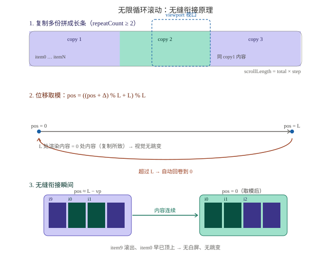

# vue-virtual-scroll-loop

高性能**无限循环滚动列表（虚拟 DOM）**，一套代码同时兼容 **Vue 2.7+ 与 Vue 3**。

- ✅ 四向滚动：`up` / `down`（纵向）、`left` / `right`（横向）
- ✅ 海量数据：仅渲染视口内 + 缓冲区项（虚拟列表），万级数据也不卡
- ✅ 无限循环：内容周期性重复，位移取模实现**无缝衔接**，无空白闪烁
- ✅ 调速：固定 `speed`（px/s）+ 运行时 `setSpeed()`
- ✅ 悬停暂停（`hoverPause`）、离屏暂停（`pauseWhenHidden`，IntersectionObserver）
- ✅ 滚轮手动滚动（`interactive`）
- ✅ 高度可定制：尺寸 / 间距 / 缓冲 / 帧率 / 循环开关 / 边界行为 / 自定义 class 等
- ✅ 可视窗口条数可控：`visibleCount` 显式指定渲染条数（默认按容器尺寸自动计算）
- ✅ 根节点外传：`rootRef` 以 props 形式接收根 DOM 元素（替代内部 `$refs`，默认 `null` 自管理）
- ✅ **TypeScript 优先**：组件源码即 `.ts`，并随构建自动生成 `dist/types/*.d.ts`，IDE 类型提示开箱即用
- ✅ **完整单元测试**：Vitest + @vue/test-utils 覆盖虚拟窗口 / 四向滚动 / 无缝循环 / 悬停暂停 / 调速 / 非循环边界等

---

## 安装

```bash
npm install vue-virtual-scroll-loop vue-demi
```

> `vue-demi` 为依赖项，会自动适配你项目中的 Vue 2 或 Vue 3。

---

## 用法

### 全局注册（插件方式）

```js
// Vue 3
import { createApp } from 'vue'
import VirtualScrollLoop from 'vue-virtual-scroll-loop'
createApp(App).use(VirtualScrollLoop).mount('#app')

// Vue 2.7（或旧版，安装 @vue/composition-api 后同样适用）
import Vue from 'vue'
import VirtualScrollLoop from 'vue-virtual-scroll-loop'
Vue.use(VirtualScrollLoop)
```

### 局部引入

```js
import { VirtualScrollLoop } from 'vue-virtual-scroll-loop'
```

### 基础示例

```vue
<template>
  <VirtualScrollLoop
    :data="list"
    direction="up"
    :speed="40"
    :item-size="44"
    :gap="8"
    hover-pause
  >
    <template #default="{ item, index }">
      <div class="row">#{{ index }} — {{ item.text }}</div>
    </template>
  </VirtualScrollLoop>
</template>
```

> 通过 `#default` 作用域插槽完全自定义每一项的内容，`{ item, index, key }` 均可使用。

---

## 实现原理（无限循环如何无缝衔接）

插件并非在「滚到最后一条」时清空重来（那样必然闪一下），而是采用 **「数据复制多份 + 位移取模回卷」**：视口永远只滑过一条被复制了 N 份的超长内容带，`pos` 一旦越过一份的长度 `L` 就取模回到 `0`，而 `0` 处画的东西与 `L` 处完全一样（第二份即第一份的复制），肉眼看不出任何跳变。



- **① 复制多份**：`repeatCount = max(2, ceil((视口+缓冲)/L) + 1)`，把 `data` 拼成 N 份长带，使「最后一条的下一个」天然就是第一条。
- **② 位移取模**：每帧 `next = ((pos + speed*dt) % L + L) % L`，`L = total * step`（`step = itemSize + gap`）。
- **③ 虚拟窗口**：只渲染视口附近 `visibleCount + 2*buffer + 1` 条，经 `idx % total` 映射回真实数据，万级数据节点数恒定。
- **无缝点**：当 `pos ≈ L` 时视口显示 `itemN + item0`，取模回 `0` 后视口显示 `item0 + item1`，内容连续重叠 → 无白屏、无跳变。

---

## Props

| 属性 | 类型 | 默认值 | 说明 |
| --- | --- | --- | --- |
| `data` | `Array` | `[]` | 数据源，支持海量数据 |
| `direction` | `'up'\|'down'\|'left'\|'right'` | `'up'` | 滚动方向。`up/down` 为纵向，`left/right` 为横向 |
| `speed` | `Number` | `30` | 滚动速度（px/秒） |
| `itemSize` | `Number` | `40` | 单项尺寸：纵向为高度，横向为宽度（px） |
| `gap` | `Number` | `0` | 项间距（px） |
| `buffer` | `Number` | `5` | 视口外额外渲染的缓冲项数（防快速滚动露白） |
| `loop` | `Boolean` | `true` | 是否无限循环；`false` 时为普通虚拟列表 |
| `autoPlay` | `Boolean` | `true` | 是否自动播放 |
| `hoverPause` | `Boolean` | `true` | 鼠标悬停时暂停 |
| `itemKey` | `String\|Function` | `null` | 单项 key：字段名或 `(item,index,idx)=>key` |
| `width` | `String\|Number` | `'100%'` | 容器宽度 |
| `height` | `String\|Number` | `200` | 容器高度 |
| `fps` | `Number` | `60` | 帧率上限 |
| `endBehavior` | `'stop'\|'reverse'` | `'stop'` | 非循环模式到边界：停止 / 反向 |
| `pauseWhenHidden` | `Boolean` | `true` | 离开视口时暂停（性能优化） |
| `interactive` | `Boolean` | `false` | 悬停时允许滚轮手动滚动 |
| `rootClass` | `String\|Array\|Object` | `''` | 根节点 class |
| `itemClass` | `String\|Array\|Object` | `''` | 单项 class |
| `emitScroll` | `Boolean` | `false` | 是否派发 `scroll` 事件（节流 100ms） |
| `visibleCount` | `Number` | `0` | 可视窗口同时渲染的数据条数。`0`（默认）按容器实测尺寸自动计算；`>0` 时强制渲染 `visibleCount` 条（外加 `buffer` 缓冲），渲染窗口不再依赖容器测量 |
| `rootRef` | `Ref<HTMLElement> \| (el)=>void \| null` | `null` | 根节点 ref（以 props 形式传入，替代内部 `$refs`）。传 Vue `Ref` 或 `(el)=>void` 回调，组件挂载后写入根 DOM 元素；`null` 时组件自行管理 |

---

## Events

| 事件 | 参数 | 说明 |
| --- | --- | --- |
| `item-click` | `{ item, index, event }` | 点击单项 |
| `reach-start` | — | 非循环模式到达起点 |
| `reach-end` | — | 非循环模式到达终点 |
| `scroll` | `{ position, direction }` | 开启 `emitScroll` 后节流派发 |
| `mouseenter` | `MouseEvent` | 鼠标进入 |
| `mouseleave` | `MouseEvent` | 鼠标离开 |

---

## 方法（通过 ref 调用）

```vue
<VirtualScrollLoop ref="scroller" ... />
```

```js
this.$refs.scroller.play()        // 播放
this.$refs.scroller.pause()       // 暂停
this.$refs.scroller.toggle()      // 切换播放/暂停
this.$refs.scroller.stop()        // 停止并归零
this.$refs.scroller.reset()       // 重置到初始状态
this.$refs.scroller.setSpeed(80)  // 动态调速（px/s）
this.$refs.scroller.scrollTo(500) // 滚动到指定数据索引
this.$refs.scroller.getPosition() // 当前位移
this.$refs.scroller.getSpeed()    // 当前速度
```

---

## 高级用法

### 固定可视窗口条数（visibleCount）

默认情况下组件按容器实测尺寸自动计算渲染多少条。若希望**显式控制可视窗口显示多少条数据**（不依赖容器测量），使用 `visibleCount`：

```vue
<template>
  <VirtualScrollLoop
    :data="list"
    direction="up"
    :item-size="44"
    :gap="8"
    :buffer="2"
    :visible-count="5"
    :height="5 * 44 + 4 * 8"   <!-- 容器高度与 visibleCount 对齐，避免留白 -->
  />
</template>
```

> `visibleCount > 0` 时，渲染窗口 = `visibleCount + 2 * buffer + 1` 条，与容器尺寸无关。
> 建议将容器 `height`（纵向）或 `width`（横向）设为 `visibleCount * (itemSize + gap) - gap`，使可视区域恰好容纳这些项。

#### 内容不足时的行为（何时会「静态不滚动」）

当**内容总长度不足以填满可视窗口**时，组件判定为「无滚动空间」，会停止滚动并将位移固定为 `0`，且**不会**派发 `reach-end` / `reach-start`：

- **非循环（`loop=false`）且 `visibleCount` 过大**：`visibleCount * (itemSize + gap) > 数据量 * (itemSize + gap)`，即你请求展示的行数多于实际数据条数。
- 任意模式下，容器实测尺寸（`clientWidth` / `clientHeight`）远大于 `scrollLength`（数据极少、容器很高）。

此时列表会以静态形式完整展示所有数据（不滚动、不循环）。这是预期行为——没有多余内容可供滚动。若希望小数据也「滚动起来」，请减小 `visibleCount` / 容器尺寸，或改用 `loop=true`（循环模式会在内容不足时自动复制填充）。

### 通过 props 接收根 DOM 元素（rootRef）

组件内部仅保留一个 `$refs`（根节点）。可通过 `rootRef` 以 props 形式接收该元素，便于在外层直接操作 DOM：

```vue
<template>
  <VirtualScrollLoop ref="scroller" :data="list" :root-ref="rootEl" />
</template>

<script setup>
import { ref } from 'vue'
const rootEl = ref(null)
// 挂载后 rootEl.value 即为组件根 <div class="vsl-root">
</script>
```

`rootRef` 支持两种形式：
- Vue `Ref`：组件挂载后写入 `.value`
- 回调函数 `(el) => void`：组件挂载/卸载时回调根元素（卸载传 `null`）

> 默认 `null` 时组件自行管理内部 ref，行为不变。

---

## 性能说明

- 渲染节点数 ≈ 视口可见条数 + `buffer * 2`（即 `visibleCount + 2 * buffer + 1`，`visibleCount = 0` 时按容器尺寸换算），与 `data.length` 无关，万级数据也恒定。
- 使用 `transform: translate3d` + `will-change` 走 GPU 合成，避免重排。
- `requestAnimationFrame` 驱动，按 `fps` 节流；`pauseWhenHidden` 在不可见时停帧。
- 容器尺寸通过 `ResizeObserver` 自适应，无需手动传宽度。

---

## 开发 / 构建 / 测试

```bash
npm install
npm run typecheck     # vue-tsc 类型检查（src）
npm run build:types   # 依据 .ts 源码生成 dist/types/*.d.ts 类型声明
npm run build         # 产出 dist/index.js (ESM) 与 dist/index.cjs (CJS)，并生成类型
npm run test          # 运行 Vitest 单元测试
npm run test:watch    # 监听模式
npm run dev           # 本地开发（配合 examples/ 调试）
```

> 发布前 `prepublishOnly` 会自动执行：`typecheck` → `build`（vite 构建 + 类型声明生成），保证类型与产物一致。

---

## TypeScript

组件源码为 `src/*.ts`，对外类型声明由源码自动生成（`dist/types/index.d.ts`）。
直接 `import` 即可获得完整类型：

```ts
import { VirtualScrollLoop, install } from 'vue-virtual-scroll-loop'
import type {
  ScrollDirection,
  EndBehavior,
  VirtualScrollLoopInstance,
  ItemClickPayload,
  ScrollPayload,
} from 'vue-virtual-scroll-loop'

// ref 调用方法时也能拿到类型
const scroller = ref<VirtualScrollLoopInstance>()
scroller.value?.setSpeed(80)
```

主要导出类型：

| 类型 | 说明 |
| --- | --- |
| `ScrollDirection` | `'up' \| 'down' \| 'left' \| 'right'` |
| `EndBehavior` | `'stop' \| 'reverse'`（非循环模式边界行为） |
| `ItemKeyFn` | `(item, index, idx) => string \| number` |
| `RootRef` | `Ref<HTMLElement \| null> \| ((el) => void) \| null`（`rootRef` 的类型） |
| `ItemClickPayload` | `{ item, index, event }` |
| `ScrollPayload` | `{ position, direction }` |
| `VirtualScrollLoopInstance` | 实例方法（`play/pause/toggle/stop/reset/setSpeed/scrollTo/getPosition/getSpeed`） |

---

## 测试

测试基于 **Vitest + @vue/test-utils + jsdom**，对底层滚动/循环逻辑做了断言（而非仅渲染）。
为在测试环境中精确驱动动画帧，测试 setup 接管了 `requestAnimationFrame` 与 `ResizeObserver` / `IntersectionObserver`，
可手动推进 `rAF` 帧来断言位移、循环取模、悬停暂停等行为。

```bash
npm run test
```

覆盖场景：

- 海量数据下仅渲染极小的虚拟窗口，且节点数与数据量无关
- 四向滚动 `up/down/left/right` 生成正确的 `translate3d` 符号
- 循环模式位移始终落在 `[0, scrollLength)`（无缝衔接）
- 悬停暂停、离屏（IntersectionObserver）暂停
- 运行时 `setSpeed` / `scrollTo` 调速与定位
- 非循环模式 `endBehavior: stop|reverse` 边界行为
- `item-click` / `scroll` 事件派发

---

## License

MIT
